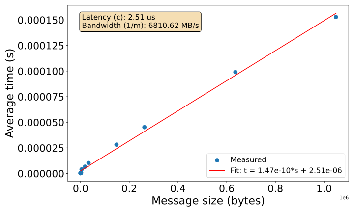

# Week 4: MPI Communications

## How to build and run

Run bash scripts from the repo root:

```bash
./week4/run_latency.sh
```

Note if a script gives a permission error, run `chmod +x week4/*.sh` first.

Compile any C file with `mpicc` and run with `mpirun`:

```bash
mpicc week4/src/pingpong.c -o bin/pingpong
mpirun -n 2 ./bin/pingpong 1000
```

The bash scripts handle compilation automatically and only recompile if the source has changed.

Plot bandwidth results with:

```bash
python3 week4/plot_bandwidth.py
```

## Test inputs

All vector addition programs set `vector[i] = i + 1`, so the correct sum is `n*(n+1)/2` as shown in Table 1.

*Table 1. Test inputs with expected sums*

| Input | Expected sum |
|-------|-------------|
| 10    | 55          |
| 100   | 5050        |
| 1000  | 500500      |
| 10000 | 50005000    |

All variants were checked against these. Note: inputs above ~65,000 overflow 32-bit `int` and give wrong results.

---

## Part 1: Demonstrating Communications

### Step 1: Run the code as-is

Copied `comm_test_mpi.c` from course materials. Compiled and ran with 2, 4, and 8 processes, multiple times each.

The print order changes between runs. This is because each process prints independently and `mpirun` merges their output in whatever order it arrives. The "Received" lines always come in rank order (1, 2, 3, ...) because rank 0's code asks for them in that order. As more processes are added we get more visible shuffling.

### Step 2: Functionalise the code

Broke `main()` into smaller functions: `root_task()`, `client_task()`, `check_uni_size()`, `check_task()`. Each change was committed separately, and the code compiled and ran correctly at every step.

### Step 3: Experiment with send types

Four variant files were created, each replacing MPI_Send with a different send mode. Ssend worked identically to the standard send and is the safest option as it waits until the receiver has started receiving before returning, though it can deadlock if two ranks both Ssend to each other at the same time. Bsend copies the message into a user provided buffer and returns immediately. With a proper buffer attached it worked fine, and without the buffer small 4-byte messages still succeeded persumably because Open MPI handles tiny messages internally. However sending 1 MiB without a buffer crashed with MPI_ERR_BUFFER, confirming the buffer is needed for larger messages. Rsend assumes the receiver is already waiting and we would expect it to fail if the receive isn't posted yet, but when testing it worked fine. It appears Open MPI silently handles it like a normal send, though this might be unreliable on other MPI implementations. Isend starts sending and returns immediately but needs an extra MPI_Request argument that the other sends don't have, so swapping it in without changes caused a compile error. The working version adds MPI_Request and calls MPI_Wait before reusing the send buffer. 

Overall Ssend is the safest for simple cases, Isend with MPI_Wait is useful when you want to overlap work with communication, Bsend needs explicit buffer setup, and Rsend is unpredictable across implementations.


### Step 4: Benchmark this code

Added `timespec_get` timing around each send and receive call.

Sends took ~4–10 μs consistently. The first receive took 13–75 μs (waiting for data to arrive), but after that, remaining receives were nearly instant because the other processes had already sent their messages while rank 0 was handling the first one.

The times varied a lot between runs, sometimes 3x different for the same operation. This shows a single shot timing isn't reliable for measuring communication cost, which is why Part 2 uses averaging.

---

## Part 2: Benchmarking latency and bandwidth

### Step 1: Write "ping pong" program

`pingpong.c` bounces a counter back and forth between two processes. The program follows this logic:

```
Get num_pings from arguments
Set counter to 0
Get start_time
While counter < num_pings
    Root sends counter to client
    Client receives counter
    Client increments counter
    Client sends counter to root
    Root receives counter
Get end_time
Calculate elapsed_time and average_time
Root prints counter, elapsed_time, average_time
```

The total time is divided by `num_pings` to get the average time per round trip.

### Step 2: Use this code to measure latency

The ping pong program was ran with increasing numbers of pings using `run_latency.sh`. Results are shown in Table 2.

*Table 2. Latency convergence with increasing ping count*

| num_pings | total time (s) | avg per ping (s) |
|-----------|---------------|------------------|
| 10        | 0.000021      | 0.000002113      |
| 100       | 0.000081      | 0.000000811      |
| 1,000     | 0.000308      | 0.000000308      |
| 10,000    | 0.002343      | 0.000000234      |
| 100,000   | 0.022393      | 0.000000224      |
| 1,000,000 | 0.209354      | 0.000000209      |

As seen in Table 2, the average converges to ~210–230 ns as the number of pings increases. Both processes run on the same machine, so this measures communication within a single node. 

### Step 3: Modify the code to measure bandwidth

`pingpong_bandwidth.c` sends an array instead of a single integer. Takes two arguments, number of pings and array size in bytes.

Ran with sizes from 8 B to 2 MiB using `run_bandwidth.sh`. As the assignment asks, a linear fit t = m × size + c was applied. Communication time has two components, the time to start the communication (latency) and the time to transmit the data (which depends on bandwidth). In the linear formula, c (the intercept) corresponds to latency as it is the fixed time per message at zero payload, and 1/m (the inverse slope) corresponds to bandwidth as it is the data transfer capacity in bytes per second. From the fit, latency = 2.64 μs and bandwidth = 6911 MB/s.



*Figure 1. Average time per ping-pong vs message size with linear fit*

The linear fit holds well for small to medium message sizes as shown in Figure 1. Above ~1 MiB, we found the measured times rise faster than the fit predicts. Data transfer speed depends on where the data is stored, transfer from cache to processor is nearly instant, while accessing main memory is slower. For large messages, data no longer fits in the faster levels of the memory hierarchy, increasing the per byte transfer cost and breaking the constant bandwidth assumption of the linear model.

---

## Part 3: Collective Communications

All programs here are based on the week 3 parallel vector addition (`vector_mpi.c`). Each process sums its chunk of the array, then the partial sums are combined.

### Step 1: Broadcast vs Scatter vs DIY

We explore three ways to get the array from root to all processes:

- **Bcast** (`vector_mpi_bcast.c`): sends the entire array to everyone.
- **Scatter** (`vector_mpi_scatter.c`): sends each process only its chunk.
- **DIY** (`vector_mpi_diy.c`): root manually sends chunks one at a time with `MPI_Send`/`MPI_Recv`.

We would expect Scatter to be fastest because it only sends each process the data it needs, so the total data moved is minimised. Bcast should be second as it uses an optimised internal algorithm but sends the full array to every process, meaning more data is transferred overall. DIY should be slowest because root sends each chunk one at a time in a loop, so each send has to complete before the next begins, whereas the collectives can overlap transfers internally.

Bash script `run_dist.sh` was used with 4 processes and the data is shown in Table 3.

*Table 3. Distribution time by method and vector size (4 processes)*

| Method  | 1K (s)   | 10K (s)  | 100K (s) | 1M (s)   | 10M (s)  |
|---------|----------|----------|----------|----------|----------|
| Bcast   | 0.000028 | 0.000091 | 0.000232 | 0.002076 | 0.013888 |
| Scatter | 0.000049 | 0.000062 | 0.000108 | 0.000972 | 0.015352 |
| DIY     | 0.000053 | 0.000076 | 0.000520 | 0.004619 | 0.040733 |

As seen in Table 3, prediction was correct for medium to large arrays. Scatter beat Bcast by ~2x in the 10K–1M range because it sends 4x less date. DIY was 2–4x slower because root sends one message at a time instead of using an optimised collective. At very small sizes, Bcast was slightly faster than Scatter likely due to simpler setup. At 10M, Scatter and Bcast converged as we would expect as memory speed became the bottleneck.

### Step 2: Send/Recv vs Gather vs Reduce

Since scatter was found to be best overall we build on this, and we explore three ways to get partial sums back to root:

- **SendRecv** (`vector_collect_sendrecv.c`): each client sends its partial sum, root receives one at a time and adds them up.
- **Gather** (`vector_collect_gather.c`): `MPI_Gather` collects all partial sums into an array on root, root sums the array.
- **Reduce** (`vector_collect_reduce.c`): `MPI_Reduce` with `MPI_SUM` collects and sums in one call.

We would expect Reduce to be fastest because it collects partial sums and computes the final sum in a single collective call, avoiding any extra loop on root. Gather should be second as it collects all partial sums efficiently in one call, but root still has to loop through the gathered array to sum it. SendRecv should be slowest because root receives one partial sum at a time in a sequential loop, the same bottleneck as DIY distribution.

Results with 4 processes from `run_collection.sh` are shown in Table 4.

*Table 4. Collection time by method and vector size (4 processes)*

| Method   | 1K (s)   | 10K (s)  | 100K (s) | 1M (s)   | 10M (s)  |
|----------|----------|----------|----------|----------|----------|
| SendRecv | 0.000020 | 0.000007 | 0.000009 | 0.000010 | 0.000012 |
| Gather   | 0.000012 | 0.000012 | 0.000004 | 0.000006 | 0.000003 |
| Reduce   | 0.000058 | 0.000016 | 0.000007 | 0.000009 | 0.000009 |

As shown in Table 4, Gather was actually fastest, not Reduce. The times don't change with vector size because only partial sums (one integer per process) are being sent i.e the vector size only affects computation, not communication. With just 4 integers being collected, Reduce's extra internal overhead outweighs its algorithmic advantages. Those advantages should show up at scale.

At 8 processes, the same pattern held. SendRecv got relatively slower , and Reduce got closer to Gather.

### Step 3: Implement your own Reduce Operation

`vector_collect_custom_reduce.c` defines a custom sum function and registers it with `MPI_Op_create` to use in place of the built-in `MPI_SUM`. Benchmarked using `run_custom_reduce.sh` with 3 trials per size, averaged results are shown in Table 5.

Both the built in and custom versions give the same answer (50,005,000 for n=10,000). Integer addition is exact so there is no rounding difference between the two.

*Table 5. Built-in vs custom reduce collection time in μs (4 processes, averaged over 3 runs)*

| Method   | 1K (μs) | 10K (μs) | 100K (μs) | 1M (μs) | 10M (μs) |
|----------|---------|----------|-----------|---------|----------|
| Built in | 36.2    | 14.1     | 7.9       | 7.7     | 8.3      |
| Custom   | 12.2    | 11.0     | 5.1       | 5.6     | 5.1      |

As shown in Table 5, the custom version was consistently faster across all sizes. The gap is largest at small sizes (3x at 1K) and narrows at larger sizes (1.5x at 1M). As noted in Step 2, collection times are independent of vector size since only partial sums are transmitted. The built in `MPI_SUM` supports every datatype so it goes through a lookup step each time. The custom function skips that and works directly with `int` pointers. On an HPC cluster with specialised hardware, the built in would likely win because it can be offloaded to the network card, something a custom function can't do.

---

## Files

| File | What it does |
|------|-------------|
| `comm_test_mpi.c` | Base communications test with timing |
| `comm_test_ssend.c` | Synchronous send variant |
| `comm_test_bsend.c` | Buffered send variant |
| `comm_test_rsend.c` | Ready send variant |
| `comm_test_isend.c` | Non-blocking send variant |
| `pingpong.c` | Measures latency via ping-pong |
| `pingpong_bandwidth.c` | Measures bandwidth via array ping-pong |
| `run_latency.sh` | Runs latency sweep, outputs CSV |
| `run_bandwidth.sh` | Runs bandwidth sweep, outputs CSV |
| `plot_bandwidth.py` | Plots bandwidth data and fits linear model |
| `vector_mpi.c` | Baseline parallel vector addition |
| `vector_mpi_bcast.c` | Broadcast distribution |
| `vector_mpi_scatter.c` | Scatter distribution |
| `vector_mpi_diy.c` | Manual Send/Recv distribution |
| `vector_collect_sendrecv.c` | Send/Recv collection |
| `vector_collect_gather.c` | Gather collection |
| `vector_collect_reduce.c` | Built-in MPI_SUM reduce |
| `vector_collect_custom_reduce.c` | Custom reduce operation |
| `run_dist.sh` | Runs distribution benchmark |
| `run_collection.sh` | Runs collection benchmark |
| `run_custom_reduce.sh` | Runs custom vs built-in reduce benchmark |
| `latency_results.csv` | Latency data |
| `bandwidth_results.csv` | Bandwidth data |
| `distribution_results.csv` | Distribution benchmark data |
| `collection_results.csv` | Collection benchmark data |
| `custom_reduce_results.csv` | Custom reduce benchmark data |
| `bandwidth_plot.svg` | Bandwidth fit plot (Figure 1) |