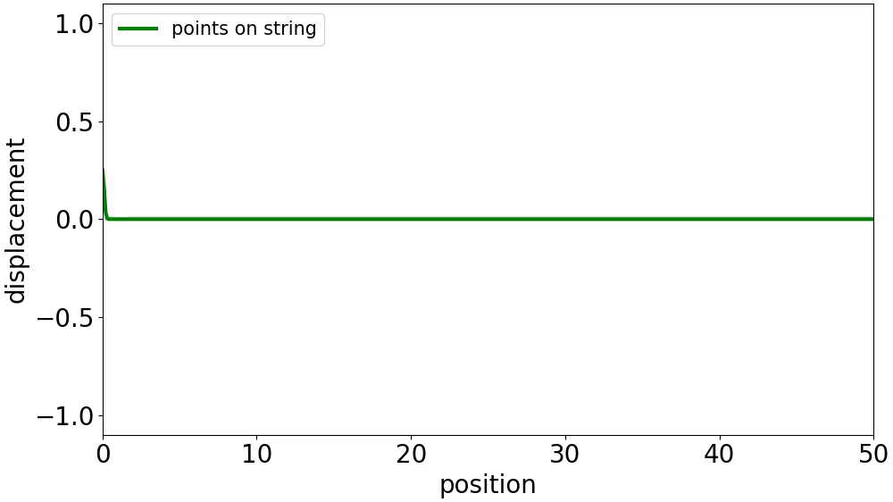

# Week 5: Communicators and Topologies

## How to build and run

Compile serial programs with `gcc` and MPI programs with `mpicc`. Both need `-lm` for the math library:

```bash
gcc week5/src/string_wave.c -o bin/string_wave -lm
gcc week5/src/string_wave_improved.c -o bin/string_wave_improved -lm
mpicc week5/src/string_wave_mpi.c -o bin/string_wave_mpi -lm
mpicc week5/src/string_wave_mpi_improved.c -o bin/string_wave_mpi_improved -lm
```

Run serial programs directly and MPI programs with `mpirun`:

```bash
./bin/string_wave 50 5 25 week5/output/string_wave.csv
mpirun -n 4 ./bin/string_wave_mpi 48 5 25 week5/output/string_wave_mpi.csv
```

The improved model accepts optional physics parameters after the output path:

```bash
./bin/string_wave_improved 500 20 400 week5/output/output.csv 2.0 0.5 0.5 50.0
```

where the optional parameters are `[K] [M] [DAMPING] [LENGTH]`, defaulting to k=2.0, m=0.5, damping=0.5, length=50.0 if omitted. Bash scripts handle compilation automatically:

```bash
./week5/run_benchmark.sh
./week5/run_benchmark_improved.sh
./week5/run_serial_improved.sh
```

Animate results with the Python scripts:

```bash
python3 week5/animate_line_file.py week5/output/string_wave.csv week5/output/string_wave.gif
python3 week5/animate_line_file_video.py week5/output/output.csv week5/output/output.mp4
```

Note: MPI programs require point counts divisible by the number of processes (e.g. 48 for 2, 4, and 8 processes).

---

## Part 1: Oscillations on a string: Serial Code

### Step 1: Run and familiarise yourself with the existing code

The provided `string_wave.c` simulates a vibrating string where each point takes the previous value of the point ahead of it, and point 0 is driven by `sin(time * 2π)`. The model is simplistic as each point just copies its left neighbour, producing a clean wave that slides along the string without any real world physics. Compiled with `gcc string_wave.c -o bin/string_wave -lm` and animated with `animate_line_file.py`.

Several values in the code were hardcoded, `cycles = 5`, `samples = 25`, and the output file path `data/string_wave.csv`. The C and Python scripts also wrote to different locations which needed fixing.

### Step 2: Remove hard-coding from the programs

Modified `string_wave.c` to accept 4 arguments: `[POINTS] [CYCLES] [SAMPLES] [OUTPUT_PATH]`. Created `Args` struct to group the parsed arguments. Replaced all hardcoded values with values from the struct.

Modified `animate_line_file.py` to accept command line arguments for input and output paths. Replaced the `generate_path()` function which hardcoded the output to `~/data/` with a `check_args()` function. If only the input CSV is given, the output defaults to the same path with `.gif` extension.

---

## Part 2: Parallelise the Code

### Step 1: Design the parallel strategy

The program has two nested loops, the outer loop iterates through timesteps and must be sequential because each timestep depends on the previous one. The inner loop updates each point's position independently, so it can be parallelised.
The parallelisation splits the string into chunks, one per process. Each process updates its chunk independently. At chunk boundaries, communication is needed because the first point of a chunk depends on the last point of the previous chunk. For a 1D string this means each rank receives one boundary value from the rank before it. Rank 0's first point is the driver and does not need incoming communication.

### Step 2: Design the aggregation strategy

Multiple processes cannot safely write to the same file, so results must be aggregated before writing. Three options were considered, MPI_Gather (one collective call), Send/Recv (root receives one chunk at a time), and on disk (separate files combined afterwards).
MPI_Gather was chosen based on week 4 benchmarks where it was the fastest collection method. Send/Recv was 2-4x slower due to serialised receives. On disk adds I/O overhead and post-processing complexity. Root collects all chunks via Gather each timestep and writes the complete row to the CSV.

### Step 3: Implement your strategies

Implemented in `string_wave_mpi.c`. The `update_positions` function was extracted from the inline code so it could be modified independently later. Verified the parallel output against the serial output using `diff`:

```bash
./bin/string_wave 48 5 25 week5/output/string_wave_serial.csv
mpirun -n 4 ./bin/string_wave_mpi 48 5 25 week5/output/string_wave_mpi.csv
diff week5/output/string_wave_serial.csv week5/output/string_wave_mpi.csv
```

The files were identical, confirming the MPI version produces the same results. The animation was also checked and shows the same wave pattern.

### Step 4: Test your work

Benchmarked serial vs MPI with 2, 4, and 8 processes across sizes from 48 to 48,000 points. Both Gather and SendRecv collection methods were tested. Results with Gather are shown in Table 1.

*Table 1. Elapsed time for serial vs MPI (simple model, Gather collection)*

| Points | Serial (s) | MPI-2 (s) | MPI-4 (s) | MPI-8 (s) | Best speedup |
|--------|-----------|-----------|-----------|-----------|-------------|
| 48     | 0.000502  | 0.000577  | 0.000633  | 0.000693  | 0.87        |
| 240    | 0.002143  | 0.002326  | 0.004616  | 0.002944  | 0.92        |
| 480    | 0.004590  | 0.004303  | 0.004563  | 0.005823  | 1.07        |
| 2,400  | 0.021426  | 0.021442  | 0.021073  | 0.022093  | 1.02        |
| 4,800  | 0.042483  | 0.045701  | 0.043023  | 0.046168  | 0.99        |
| 24,000 | 0.208483  | 0.218432  | 0.215233  | 0.243232  | 0.97        |
| 48,000 | 0.403147  | 0.423954  | 0.424980  | 0.428800  | 0.95        |

Serial was faster at all tested sizes, with best speedup never exceeding 1.07. More processes generally made it worse, with MPI-8 consistently the slowest. Switching from Gather to SendRecv for collection made no meaningful difference, confirming the bottleneck is not which collection method is used but the actual collection itself.

The per element computation is too cheap to offset the communication cost. Both computation and communication scale linearly with N , so their ratio stays constant regardless of problem size hence this model does not benefit from parallelisation.

---

## Part 3: Improve the model (Freeform exercise)

### Physics model

The original `update_positions()` uses a copy rule where each point takes the previous value of the point to its left i.e `new[i] = old[i-1]`. This produces a wave that slides along the string without reflecting, dispersing, or behaving like a real vibrating string. There is no concept of force, mass, or acceleration.

The improved model implemented here treats each point as a mass connected to its neighbours by springs. The force on point i comes from Hooke's law applied to both neighbours:

$$f_i = k \cdot \frac{x_{i+1} - 2x_i + x_{i-1}}{dx^2}$$

where k is the spring constant and dx is the spacing between points. This is the discrete form of the second spatial derivative from the wave equation. Adding Newton's second law (F = ma) and a damping term gives the acceleration:

$$a_i = \frac{k}{m} \cdot \frac{x_{i+1} - 2x_i + x_{i-1}}{dx^2} - \gamma \cdot v_i$$

where m is the mass per point and γ is the damping coefficient. At each timestep, the update follows Euler integration:

```
velocity[i] += acceleration[i] * dt
position[i] += velocity[i] * dt
```

The string has a fixed physical length (50.0 units) with `dx = length / (points - 1)`. Point 0 is driven by `sin(t * 2π)` and the last point is pinned at zero (both ends fixed). The wave speed is determined by the spring constant and mass: $c = \sqrt{k/m}$, and the wavelength by $\lambda = c / f$ where f is the driving frequency. The default parameters are k=2.0, m=0.5, damping=0.5.


*Figure 1. Wave reflecting off the fixed end of the string (k=20, m=0.5, 500 points, length=50, no damping)*


### Damping regimes

Without damping, the continuous energy input from the driver causes amplitudes to grow without bound. Adding damping dissipates energy. The damping parameter γ controls how quickly energy is removed from the system.


*Figure 2. Light damping (k=10, m=0.5, γ=0.5, 500 points, length=50)*

With light damping, the wave propagates along the string and reflects off the pinned end, producing interference patterns. The amplitude decays gradually over distance as energy is dissipated. The wave still clearly oscillates and travels.



*Figure 3. Heavy damping (k=10, m=0.5, γ=3.0, 500 points, length=50)*

With heavy damping, the wave barely propagates. The driver moves point 0 but the displacement dies out within a short distance of the driven end. The damping removes energy faster than the springs can transmit it along the string and thus the wave can never reach the other end.

### MPI parallelisation with Cartesian topology

The improved model needs both left and right neighbours for the spring force, so boundary communication becomes bidirectional. A 1D non-periodic Cartesian topology (MPI_Cart_create) identifies each process's neighbours via MPI_Cart_shift, which returns MPI_PROC_NULL at the string endpoints so no manual if-statements are needed. Boundary values are exchanged using MPI_Sendrecv which avoids deadlocks by combining send and receive. Aggregation remains MPI_Gather as in Part 2.
### Benchmark results

The improved model performs roughly 5-10 floating point operations per point per timestep compared to 1 copy operation in the original. This should improve the computation to communication ratio. Results are shown in Table 2.

*Table 2. Elapsed time for serial vs MPI (improved spring model)*

| Points | Serial (s) | MPI-2 (s) | MPI-4 (s) | MPI-8 (s) | Best speedup |
|--------|-----------|-----------|-----------|-----------|-------------|
| 48     | 0.010218  | 0.011505  | 0.011318  | 0.011064  | 0.92        |
| 240    | 0.054866  | 0.054266  | 0.054320  | 0.056596  | 1.01        |
| 480    | 0.096584  | 0.102149  | 0.097018  | 0.099844  | 1.00        |
| 2,400  | 0.390092  | 0.402352  | 0.401252  | 0.400709  | 0.97        |
| 4,800  | 0.740909  | 0.760367  | 0.902748  | 0.765792  | 0.97        |
| 24,000 | 3.340157  | 3.579792  | 3.731825  | 3.544697  | 0.94        |
| 48,000 | 6.772870  | 6.900060  | 6.839030  | 6.798610  | 1.00        |

The heavier computation shifted the speedup from consistently below 1.0 (Table 1) to hovering around 1.0 (Table 2), confirming the prediction from Part 2 that more computation per point would improve the ratio. However, the improvement was not enough to produce meaningful speedup on shared memory, and this might just be due to noise.

The same code was also tested on a dual socket server (2x Intel Xeon E5-2620 v4, 16 cores) to test whether separate memory controllers would help. At 48,000 points, serial took 18.3s and MPI-16 took 24.2s.
t
### Why parallelisation does not help this problem

Every timestep, all N positions must be gathered to root for file writing. This all-to-one communication scales linearly with N, the same rate as the computation. Adding processes splits the computation but does not reduce the Gather cost. The bottleneck is the communication pattern, not the hardware. This was confirmed by testing on both a single-socket PC and the dual-socket server with no improvement on either.
A possible improvement would be gathering once at the end instead of every timestep, but this increases memory usage significantly and was not implemented here.

### Further work

The Euler integration used here is first-order and can drift in energy. Other numerical methods such as leapfrog method might be worth exploring as it gives second-order accuracy instead and better energy conservation. The spring force model itself is the same physics as that of a single mass spring system, extended across a chain of coupled oscillators.

---

## Files

| File | Description |
|------|------------|
| `src/string_wave.c` | Original serial string wave (copy-based update) |
| `src/string_wave_improved.c` | Improved serial model with spring forces, damping, and fixed length |
| `src/string_wave_mpi.c` | MPI parallel version of the original model |
| `src/string_wave_mpi_improved.c` | MPI parallel version of the improved model with Cartesian topology |
| `src/animate_line_file.py` | Animates CSV output to GIF |
| `src/animate_line_file_video.py` | Improved animation script with auto-stride, auto-scaling, and MP4/GIF output |
| `explore.ipynb` | Jupyter notebook for benchmark analysis and plotting |
| `run_benchmark.sh` | Benchmarks serial vs MPI for the original model |
| `run_benchmark_improved.sh` | Benchmarks serial vs MPI for the improved model |
| `run_serial_improved.sh` | Compiles, runs, and animates the improved serial model |
| `output/benchmark_results.csv` | Benchmark data for the original model |
| `output/benchmark_improved_results.csv` | Benchmark data for the improved model |
| `output/reflection.gif` | Wave reflection animation (Figure 1) |
| `output/light_damping.gif` | Light damping animation (Figure 2) |
| `output/heavy_damping.gif` | Heavy damping animation (Figure 3) |

